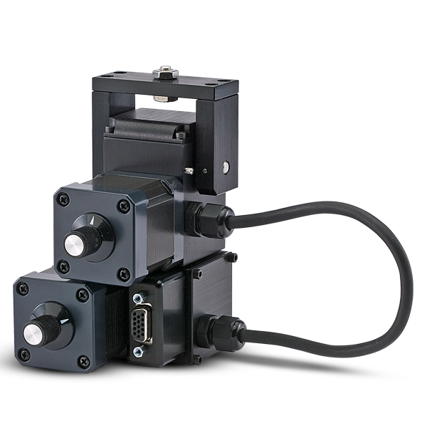

# Directed Perception `PAN TILT UNIT` Driver



## Manual

[PTU-D46 Manual](./doc/PTU-manual-E46-1.00-SMALL.pdf)

## Setup

### Linux

Check if the device is connected:

```sh
lsusb | grep serial
```

Example:

``` 
Bus 001 Device 014: ID xxx:xxxx QinHeng Electronics CH340 serial converter
```

Change the ownership of the device:

```sh
sudo chown 1000:1000 /dev/ttyUSB0 
```

Check if the ownership is changed:

```sh
ls -al /dev/ttyUSB0 
```

### MacOS

Check if the device is connected:

```sh
ls -al /dev/tty.*
```

Example:

```
crw-rw-rw-  1 root  wheel  0x9000004 Jul  2 15:19 /dev/tty.usbserial-10
```

Note: In macOS, the device ownership not need to be changed.
